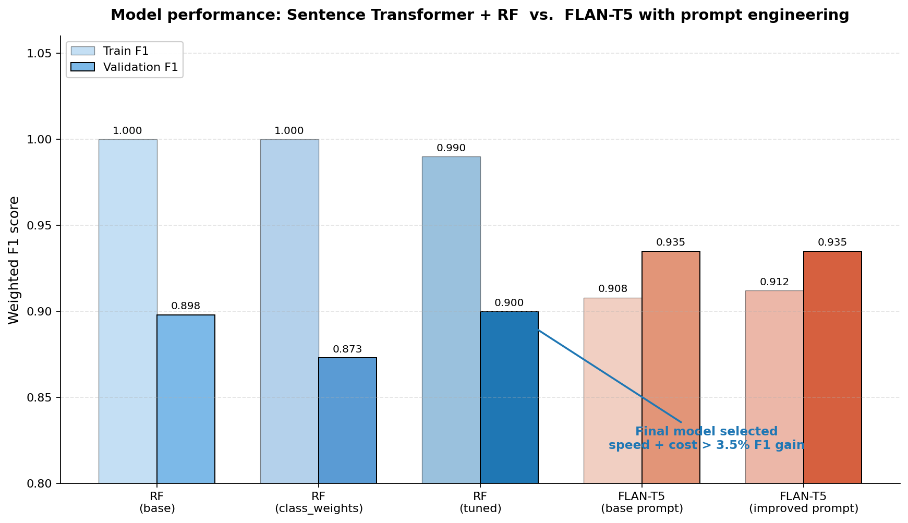
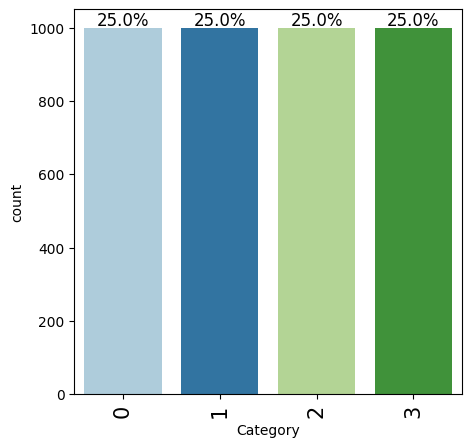
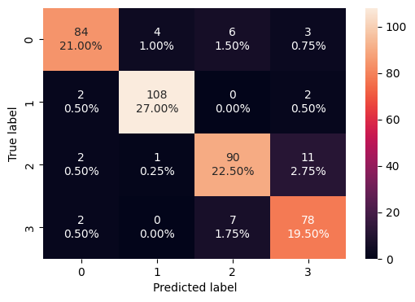
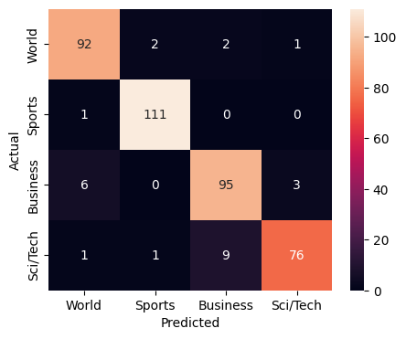

# News Article Topic Classification — NLP

Comparing classical ML and large language models for automated news categorization, with a production-aware model selection.

**Problem.** E-news Express, a news aggregation startup, needs to automatically categorize incoming articles into **World, Sports, Business,** or **Sci/Tech** to deliver content to the right audience without manual triage.

**Approach.** Built and benchmarked two NLP pipelines, then picked the model that wins on the *real* objective — production latency and cost, not just F1.

---

## Results at a glance



| Model | Val Accuracy | Val F1 (weighted) | Latency | Infra |
|---|---|---|---|---|
| Random Forest (base) | 0.898 | 0.898 | ms / article | CPU |
| Random Forest (class_weights) | 0.873 | 0.873 | ms / article | CPU |
| **Random Forest (tuned) — selected** | **0.900** | **0.900** | **ms / article** | **CPU** |
| FLAN-T5-Large (base prompt) | 0.935 | 0.935 | seconds / article | GPU |
| FLAN-T5-Large (improved prompt) | 0.935 | 0.935 | seconds / article | GPU |

**Test set:** Tuned Random Forest achieved **85% accuracy** on a held-out test set.

---

## What's in this repo

```
.
├── README.md
├── requirements.txt
├── notebook/
│   ├── news_classification.ipynb          # Clean, runnable notebook
│   └── news_classification_executed.html  # Original notebook with all outputs and plots
└── images/                                # All confusion matrices and the comparison chart
```

---

## Methodology

### Dataset
- 4,000 news articles, 4 balanced classes (1,000 each)
- Split: 80% train / 10% validation / 10% test, stratified

### Approach 1 — Sentence Transformer + Random Forest
1. Encode articles with `all-MiniLM-L6-v2` into dense 384-d embeddings
2. Train Random Forest on those embeddings, three variants:
   - Base
   - With `class_weight='balanced'`
   - Hyperparameter-tuned via `GridSearchCV` (best: `max_depth=9, n_estimators=100, max_features='sqrt'`)

### Approach 2 — FLAN-T5-Large with prompt engineering
1. Zero-shot classification using `google/flan-t5-large` (loaded in fp16)
2. Two prompts:
   - **Base prompt:** "Classify the news article below into one of the following categories…"
   - **Improved prompt:** Same instruction *plus* a one-line definition for each category

The improved prompt is the experiment that matters — same model, same temperature, same compute cost. The only thing that changed was the prompt.

---

## Selected highlights

### Class distribution — perfectly balanced


### Tuned Random Forest — validation confusion matrix (selected model)


The tuned RF gets 90% validation accuracy. Most confusion is between Business (class 2) and Sci/Tech (class 3) — articles about tech companies legitimately straddle both.

### FLAN-T5 improved prompt — validation confusion matrix


Better separation on the World/Business boundary after adding category definitions to the prompt. This is the kind of confusion that's hard to fix in a classical model but trivial to nudge with a clearer instruction.

---

## Why Random Forest and not the higher-F1 LLM

The tuned RF was selected as the production model **despite FLAN-T5 scoring 3.5% higher** on F1. Reasoning:

1. **Latency.** RF predicts in milliseconds on CPU. FLAN-T5-Large takes seconds per article on GPU.
2. **Cost.** RF runs on any server; FLAN-T5 needs a GPU instance (recurring cloud spend).
3. **The gap is small relative to the throughput tradeoff** for a real-time news pipeline.

**Recommended deployment:** RF as primary, FLAN-T5 as a fallback when RF's predicted probability falls below a confidence threshold. Cheap on the easy cases, smart on the hard ones.

---

## Reproducing the work

```bash
git clone https://github.com/thehotpath/news-topic-classification.git
cd news-topic-classification
pip install -r requirements.txt
jupyter notebook notebook/news_classification.ipynb
```

A T4 GPU (Colab free tier) is recommended for the FLAN-T5 sections. The Random Forest pipeline runs comfortably on CPU.

---

## Stack

`Python` · `scikit-learn` · `sentence-transformers` (MiniLM) · `Hugging Face transformers` · `FLAN-T5-Large` · `pandas` · `matplotlib` · `seaborn` · `PyTorch`

---

## Recommendations to the business

1. Deploy tuned Random Forest as the primary categorization model
2. Route low-confidence predictions to FLAN-T5 as a second-opinion fallback
3. Invest in prompt engineering as a discipline — adding category definitions improved LLM accuracy with no extra compute
4. Consider multi-label classification for genuinely overlapping topics (e.g. geopolitics × trade policy)

---

*Author: Jazzelle Bustos*
